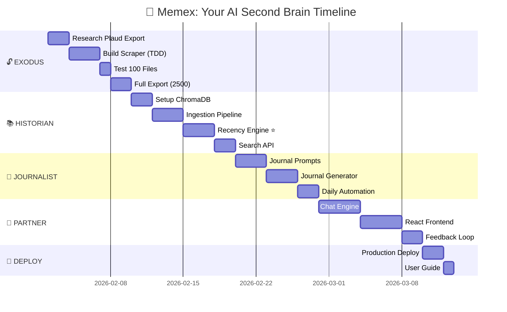
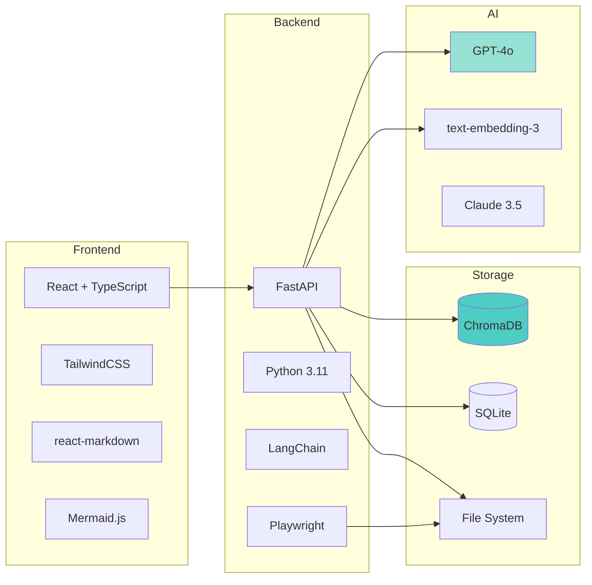
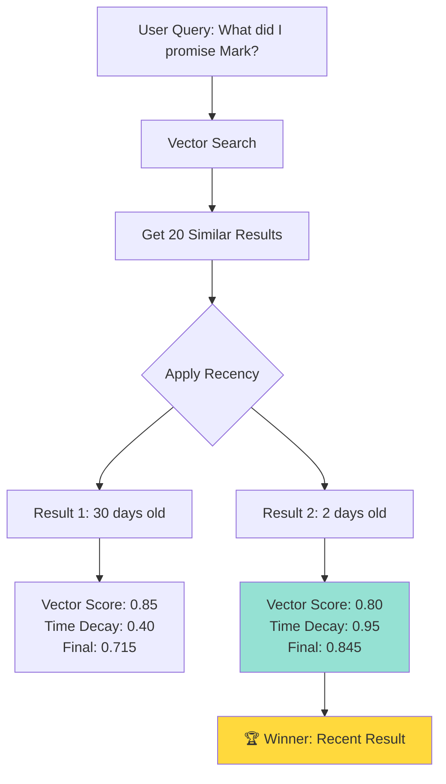
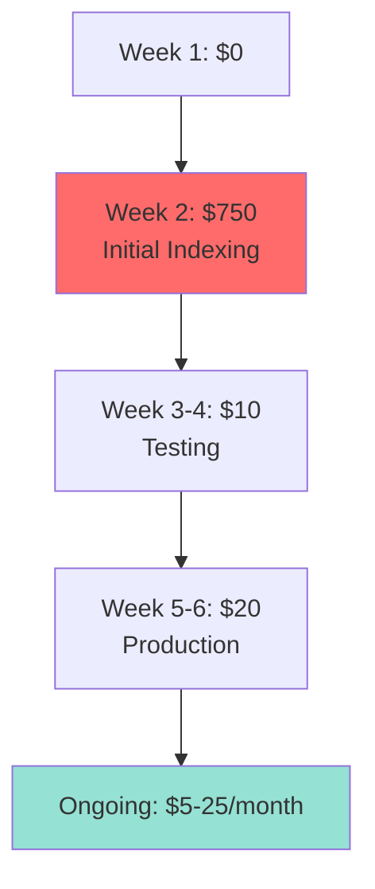

# Memex Timeline - Visual Overview



---

## Phase Breakdown (6 Weeks)

### Week 1-2: 🔓 EXODUS (Data Liberation)

**Goal:** Free your 2,500 transcripts from Plaud.AI

**Milestones:**

- ✅ Day 3: Scraper working on 10 files
- ✅ Day 5: Scraper working on 100 files
- ✅ Day 7: All 2,500 files downloaded
- ✅ Day 10: Metadata extracted and organized

**Deliverable:** Folder with 2,500+ transcript files

---

### Week 2-3: 📚 HISTORIAN (Memory System)

**Goal:** Index everything, build intelligent search

**Milestones:**

- ✅ Day 12: ChromaDB running locally
- ✅ Day 14: First 100 files indexed
- ✅ Day 16: Recency engine working (recent > old)
- ✅ Day 18: Search API complete
- ✅ Day 20: All 2,500 files searchable

**Deliverable:** Working search that finds recent + relevant memories

---

### Week 3-4: 📝 JOURNALIST (Auto Journals)

**Goal:** Daily summaries with diagrams

**Milestones:**

- ✅ Day 22: Journal prompt engineered (GPT-4)
- ✅ Day 24: First journal generated (test transcript)
- ✅ Day 26: Mermaid diagrams rendering
- ✅ Day 28: Daily automation working (cron)

**Deliverable:** Automated daily journal at 8 AM CST

---

### Week 4-5: 💬 PARTNER (Chat Interface)

**Goal:** "What did I promise Mark?"

**Milestones:**

- ✅ Day 30: Chat API working (backend)
- ✅ Day 33: React frontend MVP
- ✅ Day 36: UI polished (TailwindCSS)
- ✅ Day 38: Feedback system implemented

**Deliverable:** Full web app with chat + journals

---

### Week 5-6: 🚀 DEPLOY (Production)

**Goal:** Live and running!

**Milestones:**

- ✅ Day 40: Deployed to Railway + Vercel
- ✅ Day 42: End-to-end testing
- ✅ Day 44: User guide written
- ✅ Day 45: YOU'RE LIVE! 🎉

**Deliverable:** Production Memex at memex.copperdigital.com (or similar)

---

## Tech Stack Summary



---

## Key Innovation: The Recency Engine ⭐



**Formula:**

```
final_score = (vector_similarity × 0.7) + (time_decay × 0.3)
time_decay = 1 / (1 + 0.05 × days_old)
```

**Why this matters:**

- Standard vector DB: "What's my favorite color?" → Returns oldest/longest explanation
- **Memex:** Returns YOUR CURRENT preference (recent wins!)

---

## Success Criteria

### Phase 1 Success ✅

- [ ] 2,500+ files downloaded
- [ ] No files corrupted
- [ ] Metadata parsed correctly (dates, speakers)

### Phase 2 Success ✅

- [ ] Search returns results in <2 seconds
- [ ] Recent results rank higher than old (verified with tests)
- [ ] Can filter by date, speaker, topic

### Phase 3 Success ✅

- [ ] Daily journal auto-generated at 8 AM
- [ ] Diagrams render correctly
- [ ] Action items extracted >90% accuracy

### Phase 4 Success ✅

- [ ] Chat answers questions <5 seconds
- [ ] Cites sources with dates
- [ ] UI is intuitive (test with Arvind)

---

## Cost Timeline



**One-time spike:** Week 2 (indexing 2,500 files)  
**Optimization:** Use Claude 3.5 → Reduce to $2-10/month

---

## The Journey Ahead

**Today:** 2,500 files trapped in Plaud  
**Week 2:** Files liberated, searchable  
**Week 4:** Daily journals arriving  
**Week 6:** Full AI second brain operational

**Forever:** Never forget a commitment again. 🧠

---

**Ready? Let Nike know!** 🐾
