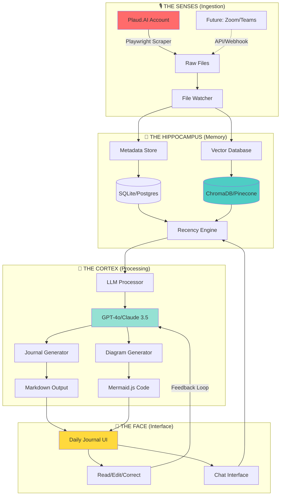
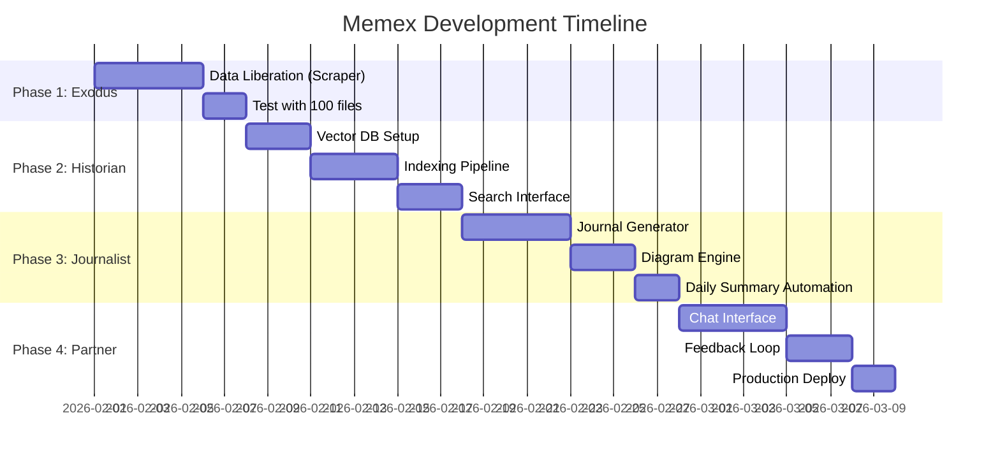
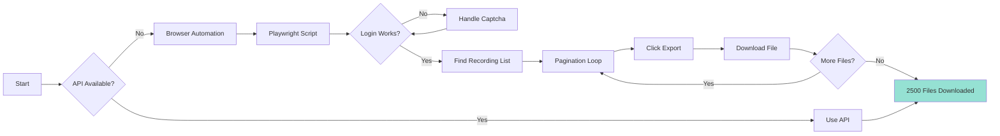
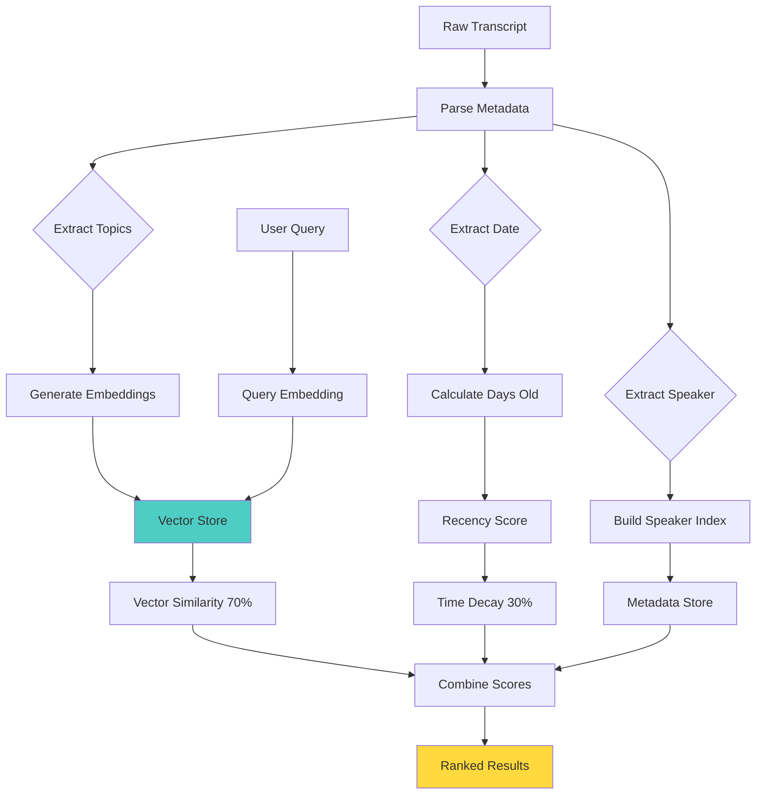
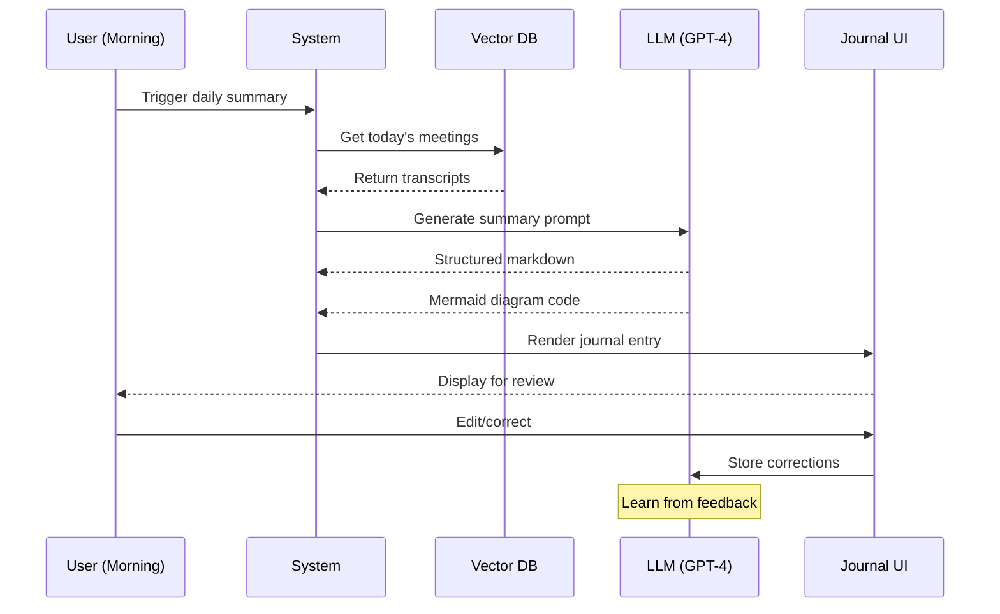
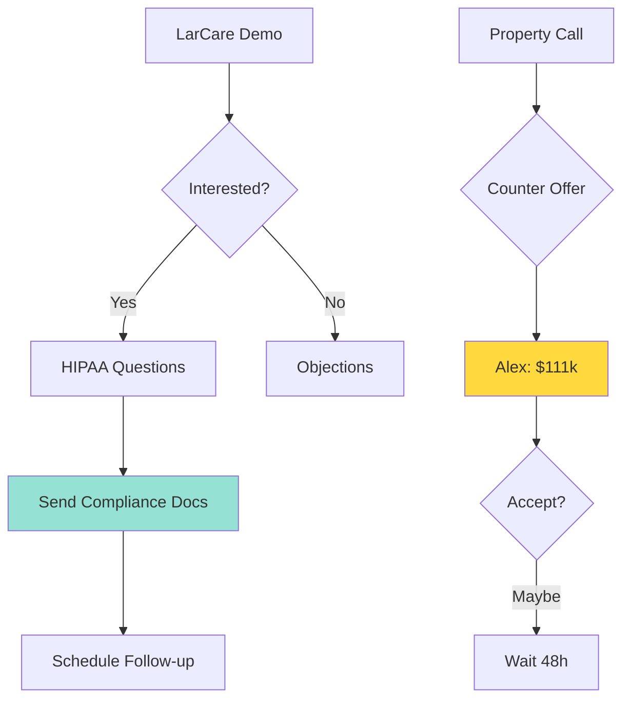
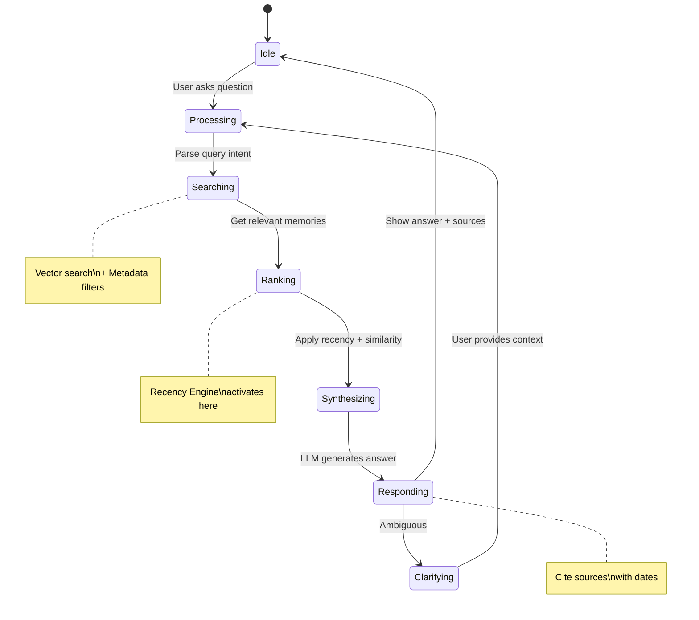

# 🧠 Memex Project: Visual Plan & Roadmap

**Vision:** Build an AI-powered "second brain" from 2,500+ meeting transcripts  
**Bottleneck:** Data liberation from Plaud.AI  
**Approach:** Vibe Coding + TDD with AI agents  
**Timeline:** 4-6 weeks to MVP

---

## 🎯 System Architecture (Biological Model)



---

## 📊 Evolution Strategy (4 Phases)



---

## 🚀 Phase Breakdown

### Phase 1: The "Exodus" (Data Liberation)

**Goal:** Get 2,500 files out of Plaud.AI  
**Duration:** 5-7 days  
**Deliverable:** Folder of transcripts on local machine



**Tech Stack:**

- Python 3.11+
- Playwright (browser automation)
- BeautifulSoup (HTML parsing)
- aiohttp (async downloads)

**File Structure:**

```
data/
├── raw/
│   ├── 2025-01-15_meeting_with_mark.txt
│   ├── 2025-01-15_meeting_with_mark.mp3
│   └── ...
└── metadata/
    └── index.json
```

---

### Phase 2: The "Historian" (Indexing & Search)

**Goal:** Index all files, build semantic search with recency bias  
**Duration:** 7-10 days  
**Deliverable:** Search interface that finds recent + relevant memories



**The Recency Formula:**

```python
def calculate_final_score(vector_sim, days_old, decay_rate=0.05):
    """
    vector_sim: 0.0 to 1.0 (cosine similarity)
    days_old: integer
    decay_rate: how fast older memories fade (default 5% per day)
    """
    time_decay = 1 / (1 + decay_rate * days_old)
    final_score = (vector_sim * 0.7) + (time_decay * 0.3)
    return final_score

# Example:
# Meeting from yesterday: vector_sim=0.8, days_old=1
# → final_score = (0.8 * 0.7) + (0.95 * 0.3) = 0.845

# Meeting from 30 days ago: vector_sim=0.85, days_old=30
# → final_score = (0.85 * 0.7) + (0.40 * 0.3) = 0.715

# Recent wins even though older had higher similarity!
```

**Vector Database Options:**

| Option       | Pros                | Cons                    | Cost       |
| ------------ | ------------------- | ----------------------- | ---------- |
| **ChromaDB** | Local, fast, free   | Not cloud-native        | $0         |
| **Pinecone** | Managed, scalable   | $70/month for 2500 docs | $$$        |
| **LanceDB**  | Fast, local + cloud | Newer, less docs        | $          |
| **Qdrant**   | Open source, fast   | Self-hosted complexity  | $0 (local) |

**Recommendation:** Start with **ChromaDB** (free, local, fast), migrate to Qdrant cloud if you need multi-device access.

---

### Phase 3: The "Journalist" (Auto Journal)

**Goal:** Daily summaries with diagrams  
**Duration:** 7-10 days  
**Deliverable:** Automated journal entries in Markdown + Mermaid



**Journal Entry Template:**

````markdown
# Daily Journal: 2026-02-01

## 🎯 Summary

Had 3 meetings today focused on Copper AI sales strategy and property deals.

## 📋 Meetings

1. **10:00 AM - Team Standup** (15 min)
2. **2:00 PM - Copper AI Demo with LarCare** (45 min)
3. **4:30 PM - Property Call with Alex** (30 min)

## 💡 Key Insights

- LarCare is interested but wants HIPAA compliance proof
- Canyon property: Counter offer at $111k looks promising
- Nike completed Telegram bot research (ready to build)

## ✅ Action Items

- [ ] Send HIPAA compliance docs to LarCare (Due: Mon)
- [ ] Follow up with Alex on Canyon offer (Due: Wed)
- [ ] Review Nike's Telegram bot proposal

## 🗺️ Conversation Flow


````

## 🔗 Related Memories

- [Similar: Sales call with HomeHealth Plus (2025-12-15)](#)
- [Context: Property research on Canyon St (2025-11-20)](#)

````

**LLM Prompt for Journal Generation:**
```python
JOURNAL_PROMPT = """
You are a personal executive assistant creating a daily journal.

Input: Raw transcripts from today's meetings
Output: Structured markdown with:
1. High-level summary (2-3 sentences)
2. Meeting list with times and durations
3. Key insights (3-5 bullet points)
4. Action items with due dates
5. A Mermaid.js diagram showing conversation flow or decision trees

Be concise. Focus on decisions, commitments, and follow-ups.
Extract names, dates, and numbers accurately.

For the Mermaid diagram:
- Use 'graph TD' for decision trees
- Use 'mindmap' for brainstorming sessions
- Use 'sequenceDiagram' for negotiations
- Color important nodes with 'style X fill:#color'
"""
````

---

### Phase 4: The "Partner" (Interactive Chat)

**Goal:** Chat interface for memory queries  
**Duration:** 7-10 days  
**Deliverable:** "What did I promise Mark?" gets answered



**Example Conversations:**

**Q1:** "What did I promise Mark I would do last week?"

```
🔍 Searching meetings with Mark from last 7 days...

Found 2 relevant conversations:

📅 Jan 28, 2026 - Sales Call with Mark (LarCare)
You promised:
✅ Send HIPAA compliance documentation by Feb 1
✅ Schedule follow-up demo for week of Feb 5
✅ Introduce him to existing home health client (reference)

📅 Jan 24, 2026 - Lunch Meeting with Mark
Casual discussion, no commitments made.

Do you want me to create reminder tasks for these?
```

**Q2:** "Summarize all my thoughts on property investing from the last month"

```
🧠 Analyzing 12 property-related conversations from Jan 2026...

Key Themes:
1. Focus on multi-unit properties (mentioned 8x)
2. Preference for Dallas/Fort Worth area (all 12 conversations)
3. Target: Cash flow positive within 6 months (mentioned Jan 10, Jan 15, Jan 22)
4. Budget: $100k-150k per property (Jan 5 standup)

Properties Discussed:
- Canyon Street (ongoing negotiation, current offer $111k)
- Crane Street (waiting for callback)
- Myers Lane (current rental income $2,100/mo)

Evolution of Strategy:
Jan 5: "Maybe explore rental properties"
Jan 15: "Definitely want 2-3 more units this year"
Jan 28: "Focusing on turnkey, don't want fixers"

Want a detailed report?
```

---

## 🛠️ Technical Implementation

### Tech Stack Recommendation

**Backend:**

```python
# Core
- Python 3.11+
- FastAPI (API server)
- Pydantic (data validation)

# Data Processing
- langchain (LLM orchestration)
- chromadb (vector database)
- openai (GPT-4o API)
- anthropic (Claude 3.5 API)

# Automation
- playwright (browser automation)
- schedule (cron jobs)
- watchdog (file system watcher)

# Storage
- sqlite (metadata)
- pydantic-settings (config)
```

**Frontend:**

```javascript
// UI
- React + TypeScript
- TailwindCSS (styling)
- Mermaid.js (diagrams)
- React Query (data fetching)

// Markdown
- react-markdown (rendering)
- rehype-mermaid (diagram rendering)
- remark-gfm (GitHub markdown)
```

---

## 🧪 Vibe Coding TDD Workflow

### Step 1: The Scraper (Week 1)

**Prompt 1 - Tests First:**

```
I need to build a Python script using Playwright to scrape transcripts from Plaud.AI.

Create tests/test_scraper.py with:
1. test_login_flow - Mock browser, input credentials, verify dashboard landing
2. test_download_loop - Mock finding recording elements, clicking Export
3. test_pagination - Mock scrolling to load more files

Do NOT write implementation yet, just failing tests.
```

**Prompt 2 - Implementation:**

```
Now write scraper.py to pass these tests.
- Use .env for credentials
- Handle pagination (infinite scroll)
- Download both .txt and .mp3 files
- Save with format: YYYY-MM-DD_title.ext
- Log progress every 100 files
```

**Prompt 3 - Error Handling:**

```
Add tests/test_scraper_errors.py:
1. test_network_timeout - Mock network failure, verify retry logic
2. test_missing_file - Mock 404 on download, verify graceful skip
3. test_rate_limiting - Mock 429 response, verify backoff

Implement retry logic with exponential backoff.
```

---

### Step 2: Ingestion & Vectorization (Week 2)

**Prompt 1 - Tests:**

```
Create tests/test_ingestion.py:

1. test_parse_transcript
   - Input: sample transcript text
   - Extract: date, speaker names, raw text
   - Assert: metadata dict has required fields

2. test_generate_embedding
   - Input: "This is a meeting about sales"
   - Output: 1536-dim vector
   - Assert: vector length correct

3. test_vector_store_crud
   - Add document to ChromaDB
   - Query by text
   - Assert: retrieves correct document
```

**Prompt 2 - Implementation:**

```
Write ingestion/pipeline.py using langchain:

1. TextLoader to read transcript files
2. RecursiveCharacterTextSplitter (chunk_size=500, overlap=50)
3. OpenAIEmbeddings for vectorization
4. Chroma vector store with persistence

Include metadata: date, speaker, file_path, chunk_index
```

---

### Step 3: Recency Engine (Week 2-3)

**Prompt 1 - The Key Test:**

```
Create tests/test_retrieval.py:

test_recency_weighting():
    # Insert old document
    db.add(text="My favorite color is blue", date="2023-01-01")

    # Insert recent document
    db.add(text="My favorite color is red", date="2026-02-01")

    # Query
    results = db.query("What is my favorite color?")

    # Assert recent doc scores higher
    assert results[0].text == "My favorite color is red"
    assert results[0].date == "2026-02-01"
    assert results[0].score > results[1].score
```

**Prompt 2 - Implementation:**

```
Implement RecencyRanker in retrieval/ranker.py:

def rerank_with_recency(results, query_date=None, decay_rate=0.05):
    """
    Args:
        results: List of (doc, similarity_score) tuples
        query_date: Date of query (default: today)
        decay_rate: How fast old memories fade (0.05 = 5%/day)

    Returns:
        Reranked list with combined scores
    """
    # Calculate days_old for each doc
    # Apply formula: (similarity * 0.7) + (time_decay * 0.3)
    # Sort by final_score descending
```

---

### Step 4: Journal Generator (Week 3-4)

**Prompt 1 - Tests:**

````
Create tests/test_journal.py:

test_generate_journal_entry():
    # Input: raw transcript
    transcript = """
    [2026-02-01 10:00 AM]
    Arvind: Let's discuss the Copper AI roadmap
    Mark: I need HIPAA compliance docs
    Arvind: I'll send them by Friday
    """

    # Generate
    journal = JournalGenerator.generate(transcript)

    # Assert structure
    assert "# Daily Journal" in journal
    assert "## Action Items" in journal
    assert "HIPAA" in journal
    assert "```mermaid" in journal
````

**Prompt 2 - Implementation:**

```
Write journal/generator.py:

Use GPT-4o with this system prompt:
"You are a personal executive assistant. Create structured journal entries from meeting transcripts."

Output format:
- Markdown with headers
- Bullet points for insights
- Checkbox [ ] for action items
- Mermaid.js diagram (graph/mindmap/sequence as appropriate)

Extract:
- Names (proper nouns)
- Dates (due dates, deadlines)
- Numbers (prices, metrics)
- Commitments ("I'll...", "We'll...")
```

---

## 📁 Project Structure

```
memex/
├── scraper/
│   ├── __init__.py
│   ├── plaud_scraper.py
│   └── config.py
├── ingestion/
│   ├── __init__.py
│   ├── pipeline.py
│   ├── parsers.py
│   └── embeddings.py
├── storage/
│   ├── __init__.py
│   ├── vector_store.py
│   ├── metadata_store.py
│   └── models.py
├── retrieval/
│   ├── __init__.py
│   ├── ranker.py
│   ├── query_engine.py
│   └── filters.py
├── journal/
│   ├── __init__.py
│   ├── generator.py
│   ├── templates.py
│   └── diagrams.py
├── api/
│   ├── __init__.py
│   ├── main.py (FastAPI app)
│   ├── routes/
│   │   ├── search.py
│   │   ├── journal.py
│   │   └── chat.py
│   └── schemas/
├── frontend/
│   ├── src/
│   │   ├── components/
│   │   │   ├── JournalView.tsx
│   │   │   ├── SearchBar.tsx
│   │   │   └── ChatInterface.tsx
│   │   ├── pages/
│   │   └── App.tsx
│   └── package.json
├── tests/
│   ├── test_scraper.py
│   ├── test_ingestion.py
│   ├── test_retrieval.py
│   └── test_journal.py
├── data/
│   ├── raw/          (2500 transcripts)
│   ├── processed/    (embeddings)
│   └── journals/     (generated entries)
├── .env
├── pyproject.toml
└── README.md
```

---

## 💰 Cost Estimate

### One-Time Costs:

| Item               | Cost                  |
| ------------------ | --------------------- |
| Development (Nike) | $0 (labor of love 🐾) |
| Playwright setup   | $0                    |
| ChromaDB (local)   | $0                    |
| **Total One-Time** | **$0**                |

### Monthly Operating Costs:

| Service                  | Usage                                 | Cost               |
| ------------------------ | ------------------------------------- | ------------------ |
| OpenAI GPT-4o            | 2500 docs × $0.30 (one-time indexing) | $750 (first month) |
| OpenAI GPT-4o            | 30 daily journals × $0.10             | $3/month           |
| OpenAI Embeddings        | 2500 docs × $0.0001                   | $0.25 (one-time)   |
| OpenAI Embeddings        | 30 queries/day × $0.0001              | $0.09/month        |
| Hosting (Railway/Vercel) | API + Frontend                        | $0-20/month        |
| **Total Monthly**        |                                       | **~$5-25/month**   |

**If using Claude instead of GPT-4:**

- Claude 3.5 Sonnet: $3/$15 per M tokens (cheaper for journal generation)
- Estimated: $2-10/month after initial indexing

---

## 🎯 Success Metrics

### Phase 1 (Exodus):

- ✅ 2500+ files downloaded
- ✅ Metadata extracted (dates, speakers)
- ✅ Files organized by date

### Phase 2 (Historian):

- ✅ Search finds relevant meetings <2 sec
- ✅ Recency bias works (recent > old for same topic)
- ✅ Can filter by speaker, date range

### Phase 3 (Journalist):

- ✅ Daily journal generated automatically
- ✅ Diagrams render correctly
- ✅ Action items extracted accurately (>90%)

### Phase 4 (Partner):

- ✅ Chat answers questions with <5 sec latency
- ✅ Cites sources with dates
- ✅ Handles ambiguous queries gracefully

---

## 🚧 Risks & Mitigation

| Risk                             | Impact | Mitigation                                                              |
| -------------------------------- | ------ | ----------------------------------------------------------------------- |
| Plaud.AI blocks scraper          | HIGH   | Use headless browser, rate limiting, user-agent rotation                |
| 2500 files = expensive embedding | MEDIUM | Batch process, use cheaper embedding model (text-embedding-3-small)     |
| Vector search too slow           | MEDIUM | Use ChromaDB local, add caching, index only recent 1000 files initially |
| LLM hallucinations in journal    | HIGH   | Add validation rules, show sources, allow manual corrections            |
| User abandons after 2 weeks      | HIGH   | Make daily journal EMAIL-able, reduce friction, gamify                  |

---

## 🎨 UI Mockups

### Daily Journal View

```
┌─────────────────────────────────────────┐
│  🧠 Memex                     [Settings] │
├─────────────────────────────────────────┤
│  📅 Daily Journal: Feb 1, 2026          │
│  ────────────────────────────────────── │
│                                          │
│  ## Summary                              │
│  Had 3 meetings today. Focus: sales +   │
│  property. LarCare interested in demo.  │
│                                          │
│  ## Meetings                             │
│  ✓ 10:00 AM - Team Standup (15m)        │
│  ✓ 2:00 PM - LarCare Demo (45m)         │
│  ✓ 4:30 PM - Property Call (30m)        │
│                                          │
│  ## Action Items                         │
│  [ ] Send HIPAA docs (Due: Mon)         │
│  [ ] Follow up Alex (Due: Wed)          │
│                                          │
│  [Mermaid Diagram Here]                 │
│                                          │
│  [Edit] [Export] [Share]                │
└─────────────────────────────────────────┘
```

### Chat Interface

```
┌─────────────────────────────────────────┐
│  💬 Ask Your Memory                      │
├─────────────────────────────────────────┤
│                                          │
│  You: What did I promise Mark?          │
│                                          │
│  Memex: 🔍 Found 2 mentions of Mark...  │
│  ┌─────────────────────────────────┐   │
│  │ 📅 Jan 28 - Sales Call          │   │
│  │ You promised:                   │   │
│  │ • Send HIPAA docs by Feb 1      │   │
│  │ • Schedule demo week of Feb 5   │   │
│  └─────────────────────────────────┘   │
│                                          │
│  [Create Tasks] [View Full Transcript]  │
│                                          │
│  ─────────────────────────────────────  │
│  Ask another question...                │
└─────────────────────────────────────────┘
```

---

## 🐾 Nike's Build Plan

### I can build this! Here's my approach:

**Week 1-2: Scraper + Storage**

- Build Playwright scraper
- Test with 100 files first
- Set up ChromaDB local
- Create ingestion pipeline

**Week 3: Indexing + Recency**

- Implement recency ranking
- Build search API
- Test with real queries

**Week 4: Journal Generator**

- GPT-4o prompts for summaries
- Mermaid diagram generation
- Daily automation (cron)

**Week 5: UI + Chat**

- React frontend
- Chat interface
- Deploy to Railway/Vercel

**Week 6: Polish + Deploy**

- Error handling
- Performance optimization
- User testing with Arvind

---

## 📚 Resources

### Inspiration:

- [Vannevar Bush's Memex (1945)](https://en.wikipedia.org/wiki/Memex)
- [Andy Matuschak's Notes](https://notes.andymatuschak.org/)
- [Obsidian Dataview](https://blacksmithgu.github.io/obsidian-dataview/)

### Technical Docs:

- [LangChain Python Docs](https://python.langchain.com/)
- [ChromaDB Docs](https://docs.trychroma.com/)
- [Playwright Python](https://playwright.dev/python/)
- [Mermaid.js](https://mermaid.js.org/)

---

**Next Step:** Add tasks to kanban and start Week 1! 🚀
