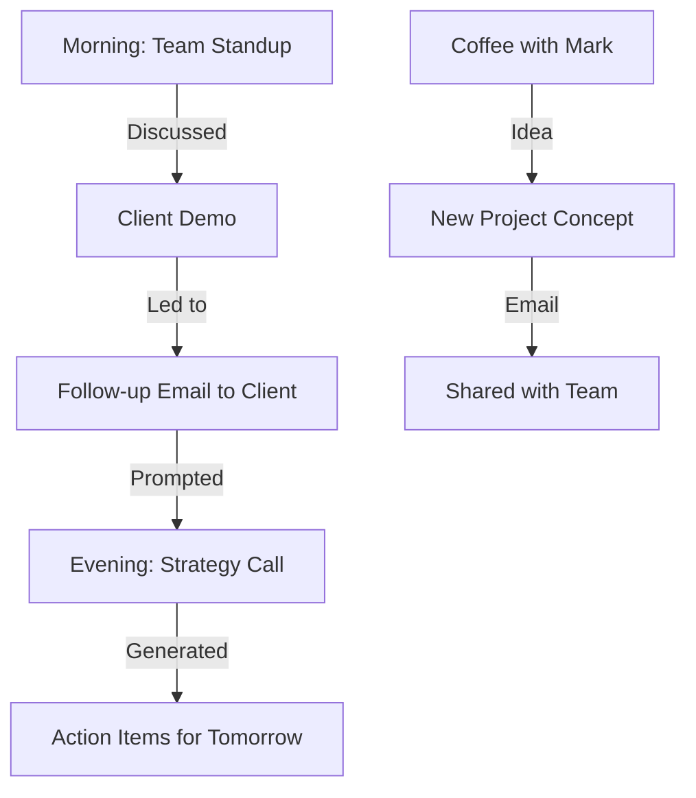

# Daily Journal Template - [YYYY-MM-DD]

**Generated:** [Timestamp]  
**Data Sources:** Plaud meetings, Gmail, Photos, Calendar  
**AI Model:** GPT-4o

---

## 📅 Your Day: [Day of Week], [Month DD, YYYY]

### Quick Summary

[2-3 sentence AI-generated summary of the day's major themes]

---

## 🌅 Morning (6 AM - 12 PM)

### Meetings & Calls

**[Time]** - [Meeting Title] ([Duration])

- **With:** [People]
- **Where:** [Location or "Phone"]
- **Key Points:**
  - [Point 1]
  - [Point 2]
  - [Point 3]
- **Decisions Made:**
  - [Decision 1]
- **Follow-ups:**
  - [ ] [Action item 1]
  - [ ] [Action item 2]

[Repeat for each meeting]

### Email Activity

- **Sent:** [X] emails
  - Important: [Recipient 1 - Subject]
  - Important: [Recipient 2 - Subject]
- **Received:** [Y] emails
  - Notable: [Sender - Subject]

### Calendar

- **[Time]** - [Event]

---

## 🌞 Afternoon (12 PM - 6 PM)

### Meetings & Calls

[Same structure as morning]

### Email Activity

[Same structure as morning]

### Photos

📸 [X] photos taken

- [Photo description 1] - [Location]
- [Photo description 2] - [Location]

[Optional: Embed top 2-3 photos inline]

---

## 🌙 Evening (6 PM - 12 AM)

### Meetings & Calls

[Same structure]

### Personal Time

- **Dinner:** [With whom / Location / Description]
- **Activities:** [What you did]
- **Photos:** [Any evening photos]

---

## 📊 Your Day in Numbers

| Metric                     | Count           |
| -------------------------- | --------------- |
| **Meetings**               | [X] ([X] hours) |
| **Emails Sent**            | [Y]             |
| **Emails Received**        | [Z]             |
| **Photos Taken**           | [N]             |
| **Locations Visited**      | [M]             |
| **People Interacted With** | [P]             |

---

## 👥 People You Connected With

**Top interactions:**

1. **[Name]** - [X] interactions ([context: meetings/emails/messages])
2. **[Name]** - [Y] interactions
3. **[Name]** - [Z] interactions

**New connections:**

- [Person] - [Context of how you met]

---

## ✅ Accomplishments

**Major Wins:**

- ✅ [Achievement 1]
- ✅ [Achievement 2]
- ✅ [Achievement 3]

**Progress Made:**

- 🔄 [Project] - [What advanced]
- 🔄 [Project] - [What advanced]

---

## 📝 Action Items Generated

**From Today's Conversations:**

**High Priority (This Week):**

- [ ] [Action 1] - From [Meeting/Email] - Due: [Date]
- [ ] [Action 2] - From [Meeting/Email] - Due: [Date]

**Medium Priority (Next 2 Weeks):**

- [ ] [Action 3]
- [ ] [Action 4]

**Low Priority (Backlog):**

- [ ] [Action 5]
- [ ] [Action 6]

---

## 🔗 Conversation Flow

**How your day connected:**

**Themes:**

- 🎯 [Theme 1: e.g., "Focus on Q1 goals"]
- 🏥 [Theme 2: e.g., "Copper AI sales push"]
- 🏠 [Theme 3: e.g., "Property research"]

---

## 💭 Reflection & Insights

### What Went Well

- [Positive observation 1]
- [Positive observation 2]

### What Could Improve

- [Challenge 1 and potential solution]
- [Challenge 2 and potential solution]

### Patterns Noticed

- [Pattern 1: e.g., "Most productive 9-11 AM"]
- [Pattern 2: e.g., "3 calls about same topic - emerging trend?"]

### Energy Levels

**Morning:** [High/Medium/Low]  
**Afternoon:** [High/Medium/Low]  
**Evening:** [High/Medium/Low]

**Most energized when:** [Activity/context]  
**Drained by:** [Activity/context]

---

## 🎯 Tomorrow's Preview

**Scheduled:**

- **[Time]** - [Meeting/Event]
- **[Time]** - [Meeting/Event]

**Should Prepare:**

- [ ] [Prep item 1]
- [ ] [Prep item 2]

**Goals for Tomorrow:**

1. [Goal 1]
2. [Goal 2]
3. [Goal 3]

---

## 🔍 Notable Quotes

> "[Interesting thing someone said]"
> — [Person], [Context]

> "[Your own insight or decision]"
> — You, [Context]

---

## 📍 Places You Went

**Locations:**

1. **[Location 1]** - [Time] - [Purpose]
2. **[Location 2]** - [Time] - [Purpose]

**Travel time:** [X] hours total

---

## 🎨 Media Gallery

[Optional: Embedded photos from the day, organized by time/theme]

---

## 📚 Related Memories

**Similar days:**

- [Link to journal: YYYY-MM-DD] - Similar because: [Reason]
- [Link to journal: YYYY-MM-DD] - Similar because: [Reason]

**This day connects to:**

- [Project: Name] - [How it relates]
- [Goal: Name] - [Progress made]

---

## 🤖 AI Analysis

**Work-Life Balance:** [X]% work, [Y]% personal  
**Primary Focus:** [Main activity type]  
**Mood Indicators:** [Positive/Neutral/Stressed] based on language patterns  
**Recommendations:**

- [AI suggestion based on patterns]

---

**Generated by:** Memex AI  
**Accuracy:** Verified from source data  
**Sources:** [X] meetings, [Y] emails, [Z] photos, [A] calendar events

---

## 📝 Manual Notes

[Space for Arvind to add personal notes/reflections]

---

_This journal was automatically generated from your digital footprint. Edits and corrections welcome!_
