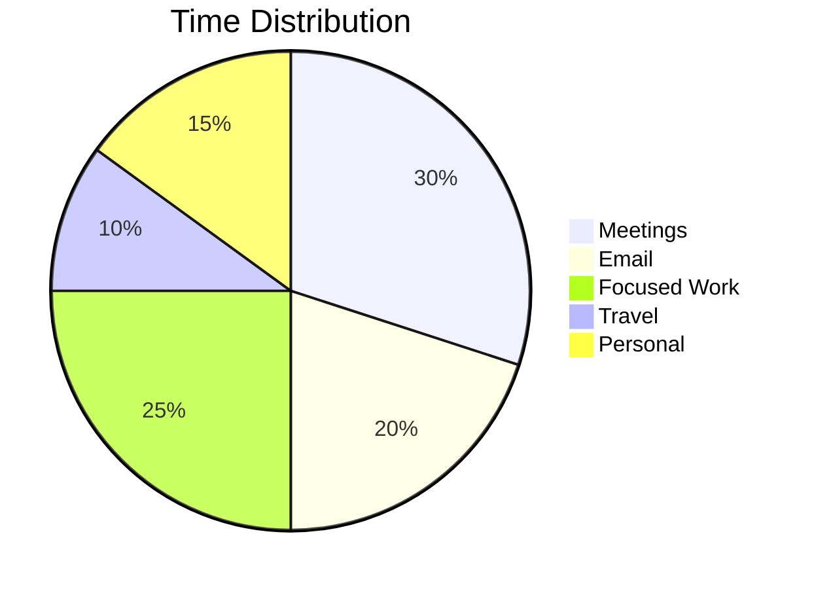

# Weekly Review Template - Week of [Month DD-DD, YYYY]

**Generated:** [Timestamp]  
**Period:** [Start Date] - [End Date]  
**Days Covered:** 7

---

## 🎯 Week at a Glance

### The Big Picture

[2-3 paragraph AI-generated summary of the week's major themes, progress, and highlights]

### Week in Numbers

| Metric                      | This Week | Last Week | Change |
| --------------------------- | --------- | --------- | ------ |
| **Meetings**                | [X]       | [Y]       | [+/-]% |
| **Total Hours in Meetings** | [H]       | [I]       | [+/-]% |
| **Emails Sent**             | [A]       | [B]       | [+/-]% |
| **Emails Received**         | [C]       | [D]       | [+/-]% |
| **Photos Taken**            | [E]       | [F]       | [+/-]% |
| **Unique People Met**       | [G]       | [H]       | [+/-]% |
| **Cities/Locations**        | [J]       | [K]       | [+/-]% |

---

## 📅 Day-by-Day Highlights

### Monday, [Date]

**Theme:** [One-word theme]  
**Highlight:** [Major event/accomplishment]  
**Meetings:** [X] - Most important: [Meeting name]

### Tuesday, [Date]

**Theme:** [One-word theme]  
**Highlight:** [Major event/accomplishment]  
**Meetings:** [X] - Most important: [Meeting name]

### Wednesday, [Date]

**Theme:** [One-word theme]  
**Highlight:** [Major event/accomplishment]  
**Meetings:** [X] - Most important: [Meeting name]

### Thursday, [Date]

**Theme:** [One-word theme]  
**Highlight:** [Major event/accomplishment]  
**Meetings:** [X] - Most important: [Meeting name]

### Friday, [Date]

**Theme:** [One-word theme]  
**Highlight:** [Major event/accomplishment]  
**Meetings:** [X] - Most important: [Meeting name]

### Saturday, [Date]

**Theme:** [One-word theme]  
**Highlight:** [Personal/rest activity]

### Sunday, [Date]

**Theme:** [One-word theme]  
**Highlight:** [Personal/rest activity]

---

## 🏆 Major Accomplishments

### Professional Wins

1. **[Win 1]** - [Details and impact]
2. **[Win 2]** - [Details and impact]
3. **[Win 3]** - [Details and impact]

### Personal Milestones

1. **[Milestone 1]** - [What it means]
2. **[Milestone 2]** - [What it means]

### Projects Advanced

- **[Project 1]** - [Progress made this week]
- **[Project 2]** - [Progress made this week]
- **[Project 3]** - [Progress made this week]

---

## 👥 Relationship Map

### Most Frequent Contacts

**Top 10 People This Week:**

1. **[Name]** - [X] interactions ([Type: meetings/emails/messages]) - [Context]
2. **[Name]** - [Y] interactions - [Context]
3. **[Name]** - [Z] interactions - [Context]
4. [Continue...]

### New Connections

- **[Person]** - [How you met] - [Potential significance]

### Relationships Strengthened

- **[Person]** - [What deepened the connection]

### Follow-ups Needed

- [ ] **[Person]** - [Why and when to reach out]
- [ ] **[Person]** - [Why and when to reach out]

---

## 📊 Time Analysis

### Where Your Time Went

**Breakdown:**

- **Meetings:** [X] hours ([Y]%)
- **Email:** [A] hours ([B]%)
- **Focused Work:** [C] hours ([D]%)
- **Travel:** [E] hours ([F]%)
- **Personal:** [G] hours ([H]%)

### Peak Productivity Times

- **Most productive:** [Day] at [Time range]
- **Least productive:** [Day] at [Time range]
- **Average energy level:** [Score]/10

### Meeting Efficiency

- **% of meetings with clear outcomes:** [X]%
- **Average meeting length:** [Y] minutes
- **Most valuable meeting:** [Meeting name] - [Why]
- **Could have been an email:** [Meeting name]

---

## 🎯 Goals Progress

### Week Goals (Set Last Week)

- [x] **Goal 1** - ✅ Completed
- [x] **Goal 2** - ✅ Completed
- [ ] **Goal 3** - ⏳ In Progress (carried forward)
- [ ] **Goal 4** - ❌ Not started (reassess priority)

### Long-Term Goals

**[Goal Category: e.g., "Copper AI Revenue"]**

- Target: [X]
- Progress this week: [Y]
- % Complete: [Z]%
- On track? [Yes/No/At Risk]

---

## 📝 Decisions Made

### Major Decisions

1. **[Decision 1]** - [Context and rationale]
2. **[Decision 2]** - [Context and rationale]

### Commitments Given

- **To [Person]:** [What you committed to] - Due: [Date]
- **To [Person]:** [What you committed to] - Due: [Date]

### Commitments Received

- **From [Person]:** [What they committed] - Expected: [Date]

---

## 🔥 Challenges & Solutions

### Problems Encountered

1. **[Challenge 1]**
   - **How you handled it:** [Solution]
   - **Outcome:** [Result]
   - **Lesson learned:** [Insight]

2. **[Challenge 2]**
   - **How you handled it:** [Solution]
   - **Outcome:** [Result]
   - **Lesson learned:** [Insight]

### Ongoing Issues

- **[Issue 1]** - [Current status and next steps]
- **[Issue 2]** - [Current status and next steps]

---

## 💡 Insights & Patterns

### What You Learned

1. [Learning 1]
2. [Learning 2]
3. [Learning 3]

### Patterns Noticed

**Productivity:**

- [Pattern about when/how you work best]

**Communication:**

- [Pattern about emails/meetings/interactions]

**Energy:**

- [Pattern about what drains or energizes you]

**Trends:**

- [Emerging trend you're seeing in your work/life]

---

## 📈 Business Metrics (if applicable)

### Copper AI

- **Demos conducted:** [X]
- **Pilot proposals sent:** [Y]
- **Customers closed:** [Z]
- **Revenue:** $[Amount]

### Properties

- **Properties viewed:** [A]
- **Offers made:** [B]
- **Deals in progress:** [C]

---

## 🎨 Week in Photos

**Highlights:**

1. [Photo description] - [Date] - [Location]
2. [Photo description] - [Date] - [Location]
3. [Photo description] - [Date] - [Location]

**Photo themes this week:**

- [Theme 1: e.g., "Office work"]
- [Theme 2: e.g., "Time with Megha"]
- [Theme 3: e.g., "Property visits"]

---

## 🌍 Places You Went

**Locations This Week:**

- **[Location 1]** - [X] visits - [Purpose]
- **[Location 2]** - [Y] visits - [Purpose]

**New places discovered:**

- [Place] - [What it was] - [Experience]

**Travel stats:**

- Total miles: [X]
- Time in transit: [Y] hours
- Longest trip: [Route] - [Duration]

---

## 💬 Quote of the Week

> "[Most memorable or insightful thing said this week]"
>
> — [Person/Source], [Context]

---

## 🎯 Next Week's Goals

### Professional

1. [Goal 1] - [Why it matters]
2. [Goal 2] - [Why it matters]
3. [Goal 3] - [Why it matters]

### Personal

1. [Goal 1] - [Why it matters]
2. [Goal 2] - [Why it matters]

### Habits to Focus On

- [ ] [Habit 1: e.g., "Exercise 3x"]
- [ ] [Habit 2: e.g., "Respond to emails within 24hrs"]
- [ ] [Habit 3: e.g., "Weekly date night with Megha"]

---

## 📅 Looking Ahead

### Next Week's Schedule

**Known commitments:**

- **Monday:** [Major event/meeting]
- **Tuesday:** [Major event/meeting]
- **Wednesday:** [Major event/meeting]
- **Thursday:** [Major event/meeting]
- **Friday:** [Major event/meeting]
- **Weekend:** [Plans]

### Preparation Needed

- [ ] [Prep task 1]
- [ ] [Prep task 2]
- [ ] [Prep task 3]

---

## 🔄 Comparison to Last Week

### What Improved

- ✅ [Improvement 1]
- ✅ [Improvement 2]

### What Declined

- ⚠️ [Area 1] - [Why and how to address]
- ⚠️ [Area 2] - [Why and how to address]

### Maintained

- ➡️ [Consistent area 1]
- ➡️ [Consistent area 2]

---

## 🤖 AI Recommendations

**Based on this week's patterns:**

1. **Time Management:** [AI suggestion]
2. **Energy Optimization:** [AI suggestion]
3. **Relationship Building:** [AI suggestion]
4. **Goal Achievement:** [AI suggestion]

**Areas to watch:**

- ⚠️ [Potential issue 1]
- ⚠️ [Potential issue 2]

---

## 📝 Personal Reflections

[Space for Arvind to add free-form thoughts about the week]

**Gratitude:**

- [Thing 1 you're grateful for]
- [Thing 2 you're grateful for]
- [Thing 3 you're grateful for]

**Wins to celebrate:**

- [Win 1]
- [Win 2]

**Areas to improve:**

- [Area 1]
- [Area 2]

---

**Week Rating:** [1-10] ⭐  
**Overall Mood:** [Positive/Productive/Challenging/Balanced]

---

_This weekly review was automatically generated from 7 daily journals plus additional analysis._

**Next review:** [Next Sunday's date]
