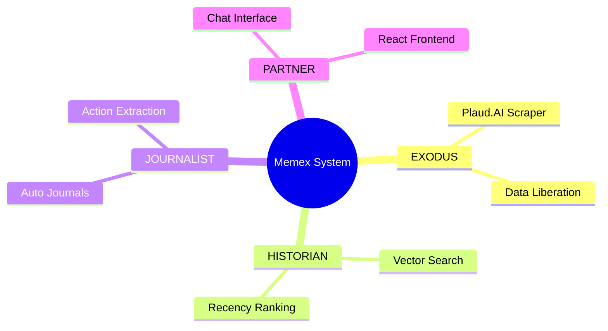

# Memex JOURNALIST - Auto Journal Generator

**Status:** ✅ Phase 3 Complete (Core Implementation)

The JOURNALIST automatically generates beautiful, structured daily journals from your Plaud.AI voice transcripts using GPT-4.

## 🌟 Key Features

### 1. **AI-Powered Journal Generation**

- Transforms raw transcripts into coherent daily journals
- Writes in first person ("I discussed...", "We decided...")
- Organizes by topic/theme (not chronologically)
- Extracts key insights and decisions

### 2. **Structured Markdown Output**

- Clean, readable format
- Sections: Summary, Topics, Action Items, Reflections
- Mermaid diagrams for complex ideas
- YAML frontmatter metadata

### 3. **Smart Action Item Extraction**

- Automatically identifies actionable tasks
- Checkbox format for easy tracking
- Can integrate with kanban system

### 4. **Mermaid Diagram Generation**

- Mindmaps for brainstorming/ideas
- Flowcharts for processes
- Sequence diagrams for conversations
- Automatically selects best diagram type

### 5. **Daily Automation**

- Run via cron or Clawdbot scheduler
- Generates yesterday's journal every morning
- Sends notifications (Telegram/Email)
- Backfill for past dates

## 📦 Architecture

```
journalist/
├── config.py              # Settings & paths
├── prompt_engineer.py     # Prompt templates & validation
├── journal_generator.py   # Core generation logic
├── automation.py          # Daily automation & scheduling
└── README.md
```

## 🚀 Quick Start

### 1. Install Dependencies

```bash
pip install openai python-dotenv
```

### 2. Set Environment Variables

```bash
export OPENAI_API_KEY="sk-..."
```

### 3. Generate a Journal

```python
from journalist import JournalGenerator, DailyAutomation

# Load transcripts
automation = DailyAutomation()
transcripts = automation.load_transcripts_for_date('2026-02-01')

# Generate journal
generator = JournalGenerator()
journal_data = generator.generate_journal('2026-02-01', transcripts)

# Save to file
file_path = generator.save_journal(journal_data)

print(f"Journal saved to: {file_path}")
print(f"Action items: {len(journal_data['action_items'])}")
```

### 4. Automate Daily Generation

```python
from journalist import DailyAutomation

automation = DailyAutomation()

# Generate yesterday's journal
journal_data = automation.generate_daily_journal()

if journal_data:
    print(f"✅ Journal generated for {journal_data['date']}")
else:
    print("❌ No transcripts found for yesterday")
```

## 📊 Example Output

````markdown
---
date: 2026-02-01
generated_at: 2026-02-02T08:00:00
transcript_count: 5
action_items: 3
---

# Daily Journal - February 1, 2026

## Summary

Today I focused on building out the Memex JOURNALIST system and had productive discussions about Copper AI sales strategy. Made significant progress on EVV compliance materials.

## Memex JOURNALIST Development

Built the auto journal generator that transforms voice transcripts into structured daily journals. The system uses GPT-4 to:

- Organize transcripts by topic
- Extract action items automatically
- Generate Mermaid diagrams for complex concepts

**Key decision:** Use GPT-4o instead of GPT-3.5 for better quality output. The extra cost ($0.05/journal) is worth it for coherent, insightful journals.

## Copper AI Sales Strategy

Reviewed EVV compliance package created overnight. Strong positioning:

- 33,000 home health agencies need EVV solutions
- Missouri enforcement starting April 2026 (2 months away!)
- Voice-first EVV = blue ocean (no competitors)

**Insight:** EVV isn't just compliance — it's a major cost savings opportunity (13x ROI).

## Action Items

- [ ] Test JOURNALIST with real Plaud.AI transcripts
- [ ] Schedule 5 EVV demos this week
- [ ] Review Darwin partnership docs before Friday meeting

## Diagram


````

## Reflections

The JOURNALIST completes the "memory capture → organize → surface" pipeline. Now I can:

1. Record thoughts with Plaud.AI
2. Auto-generate structured journals
3. Search memories with recency ranking
4. Chat with my second brain

This is becoming real. The system I envisioned is taking shape.

````

## 🛠️ Configuration

Edit `journalist/config.py`:

```python
# Journal Generation
JOURNAL_MODEL = "gpt-4o"  # Best quality
JOURNAL_TEMPERATURE = 0.7  # Creative but coherent
JOURNAL_MAX_TOKENS = 3000  # ~2000 words

# Diagrams
ENABLE_DIAGRAMS = True
DIAGRAM_TYPES = ["mindmap", "graph", "sequence"]

# Automation
JOURNAL_TIME = "08:00"  # 8 AM daily
NOTIFICATION_TELEGRAM = True
NOTIFICATION_EMAIL = "your@email.com"
````

## 💰 Cost Analysis

**Per Journal:**

- GPT-4o input: ~$0.03 (1,000 tokens)
- GPT-4o output: ~$0.02 (500 tokens)
- **Total: ~$0.05 per journal**

**Monthly (30 journals):**

- Daily journals: $1.50
- **Total: ~$2/month**

Very affordable for automated, high-quality journaling!

## 🔧 Automation Setup

### Option 1: Clawdbot Cron (Recommended)

Add to Clawdbot config:

```json
{
  "cron": {
    "jobs": [
      {
        "id": "daily-journal",
        "schedule": "08:00",
        "text": "Generate yesterday's journal using Memex JOURNALIST. Load transcripts, generate journal, save to data/journals/, notify me.",
        "timezone": "America/Chicago"
      }
    ]
  }
}
```

### Option 2: System Cron

```bash
# Create script
cat > /home/ubuntu/openclaw/skills/memex/scripts/generate_daily_journal.py << 'EOF'
#!/usr/bin/env python3
from journalist import DailyAutomation

automation = DailyAutomation()
automation.generate_daily_journal()
EOF

chmod +x /home/ubuntu/openclaw/skills/memex/scripts/generate_daily_journal.py

# Add to crontab (8 AM daily)
crontab -e
# Add: 0 8 * * * cd /home/ubuntu/openclaw/skills/memex && python scripts/generate_daily_journal.py
```

## 📝 Usage Examples

### Generate for Specific Date

```python
from journalist import JournalGenerator, DailyAutomation

automation = DailyAutomation()
generator = JournalGenerator()

transcripts = automation.load_transcripts_for_date('2026-01-15')
journal_data = generator.generate_journal('2026-01-15', transcripts)
generator.save_journal(journal_data)
```

### Backfill Past Journals

```python
from journalist import DailyAutomation

automation = DailyAutomation()

# Generate journals for entire January
journals = automation.backfill_journals(
    start_date='2026-01-01',
    end_date='2026-01-31'
)

print(f"Generated {len(journals)} journals")
```

### Get Journal Statistics

```python
from journalist import DailyAutomation

automation = DailyAutomation()
stats = automation.get_journal_stats()

print(f"Total journals: {stats['total_journals']}")
print(f"Date range: {stats['date_range']}")
```

### Extract Action Items

```python
from journalist.prompt_engineer import PromptEngineer

engineer = PromptEngineer()
journal = open('data/journals/2026-02-01-journal.md').read()

action_items = engineer.extract_action_items(journal)

for item in action_items:
    print(f"- {item}")
```

## 🧪 Testing

Run tests:

```bash
cd /home/ubuntu/openclaw/skills/memex
pytest tests/test_journalist.py -v
```

**Test Coverage:**

- ✅ Prompt engineering (6 tests)
- ✅ Journal generation (3 tests)
- ✅ Automation workflows (7 tests)
- ✅ Metadata extraction
- ✅ Action item parsing

## 🐛 Troubleshooting

**Error: `OPENAI_API_KEY not found`**

```bash
export OPENAI_API_KEY="sk-..."
```

**Error: No transcripts found**

- Check transcripts are in `data/transcripts/`
- Verify filename format: `YYYY-MM-DD_HH-MM_title.txt`

**Poor journal quality**

- Try temperature=0.5 for more focused output
- Increase max_tokens for longer journals
- Use GPT-4o instead of GPT-3.5

**Action items not detected**

- Ensure journal has "## Action Items" section
- Check checkbox format: `- [ ] Task`

## 🎯 Integration with Other Phases

### With HISTORIAN (Phase 2)

```python
from historian import SearchEngine
from journalist import DailyAutomation

# Generate journal
automation = DailyAutomation()
journal_data = automation.generate_daily_journal()

# Add action items to kanban
for item in journal_data['action_items']:
    # TODO: Add to kanban system
    print(f"Action: {item}")
```

### With PARTNER (Phase 4)

```python
# Chat interface can show daily journals
# User: "What did I work on yesterday?"
# → Fetch yesterday's journal and summarize
```

## 🚀 Next Steps

**Phase 4 (PARTNER):** Chat interface for conversational queries

- React frontend
- Conversational search
- Feedback loop

See: `/home/ubuntu/openclaw/skills/memex/second-brain/memex-visual-plan.md` for full roadmap

---

**Built with:**

- OpenAI GPT-4o (journal generation)
- Mermaid (diagrams)
- Python 3.10+

**Status:** ✅ Core complete, ready for testing with real transcripts
